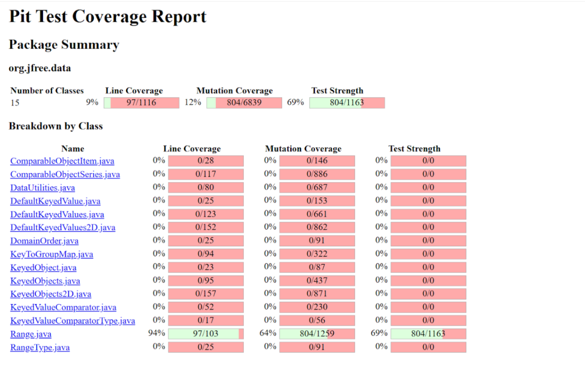
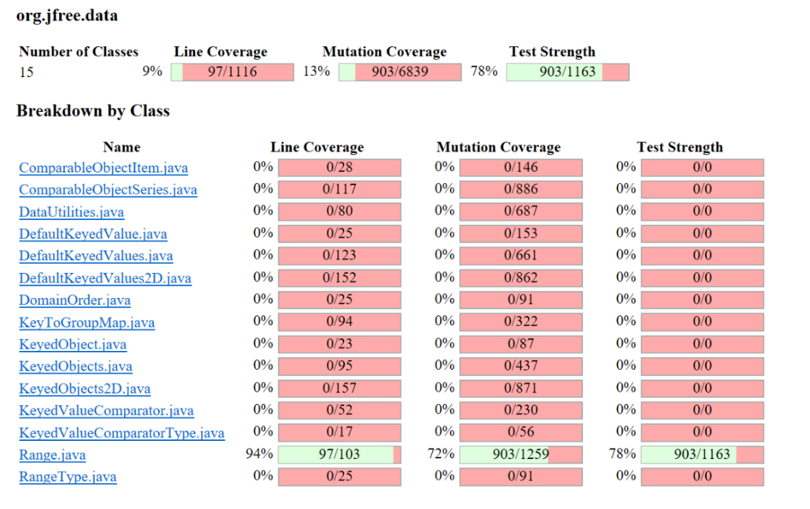
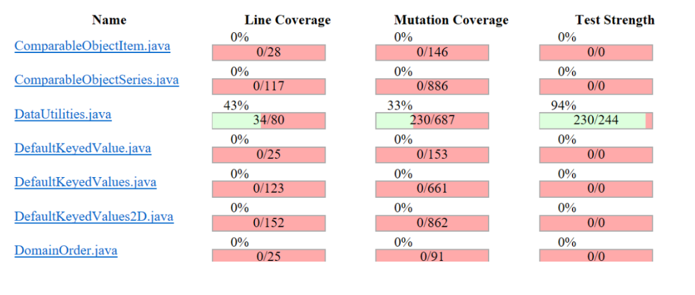
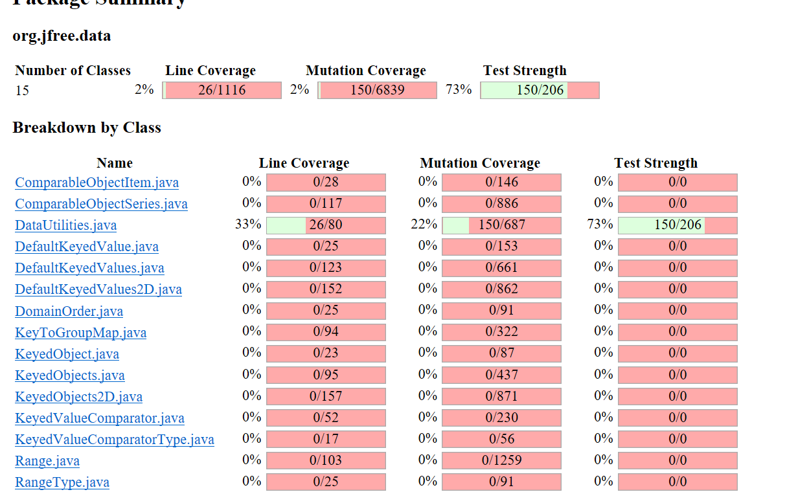

**SENG 438 - Software Testing, Reliability, and Quality**

**Lab. Report \#4 – Mutation Testing and Web app testing**

| Group \#: 2     |     |
| -------------- | --- |
| Student Names: |     |
|      Qasim Amar          |     |
|      Said Rahmani          |     |
|             Ahmed Addullah
|    Muhammad Bilal |

# Introduction

# Analysis of 10 Mutants of the Range class 
1. Mutant: Incremented (a++) double field lower: SURVIVED
Mutation: The lower field of the Range class is incremented after its value is used.
Behavior: This mutation does not affect the calculation of the central value because the increment happens after the value is used.
Reason for Survival: The test suite likely does not verify the state of the lower field after the method call, allowing the mutant to survive.

2. Mutant: Incremented (a++) double field upper: SURVIVED
Mutation: The upper field of the Range class is incremented after its value is used.
Behavior: Similar to the first mutant, this mutation does not impact the central value calculation.
Reason for Survival: The test suite does not check the state of the upper field after the method call.

3. Mutant: Decremented (a--) double field lower: SURVIVED
Mutation: The lower field is decremented after its value is used.
Behavior: The decrement does not affect the central value calculation.
Reason for Survival: The test suite does not verify the state of the lower field after the method call.

4. Mutant: Decremented (a--) double field upper: SURVIVED
Mutation: The upper field is decremented after its value is used.
Behavior: The decrement does not affect the central value calculation.
Reason for Survival: The test suite does not verify the state of the upper field after the method call.
5. Mutant: Substituted 2.0 with 1.0: KILLED
Mutation: The divisor 2.0 in the central value calculation is replaced with 1.0.
Behavior: This changes the calculation from (lower + upper) / 2.0 to (lower + upper) / 1.0, effectively removing the division.
Reason for Killing: The test suite likely includes assertions that verify the correct central value, which would fail when the divisor is incorrect.

6. Mutant: Replaced double division with multiplication: KILLED
Mutation: The division operation in the central value calculation is replaced with multiplication.
Behavior: The calculation changes from (lower + upper) / 2.0 to (lower + upper) * 2.0.
Reason for Killing: The test suite detects the incorrect result because the expected central value is not matched.

7. Mutant: Replaced double addition with subtraction: KILLED
Mutation: The addition operation in the central value calculation is replaced with subtraction.
Behavior: The calculation changes from (lower + upper) / 2.0 to (lower - upper) / 2.0.
Reason for Killing: The test suite detects the incorrect result because the expected central value is not matched.
8. Mutant: Replaced double division with modulus: KILLED
Mutation: The division operation is replaced with the modulus operation.
Behavior: The calculation changes from (lower + upper) / 2.0 to (lower + upper) % 2.0.
Reason for Killing: The test suite detects the incorrect result because the expected central value is not matched.

9. Mutant: Replaced double addition with multiplication: KILLED
Mutation: The addition operation is replaced with multiplication.
Behavior: The calculation changes from (lower + upper) / 2.0 to (lower * upper) / 2.0.
Reason for Killing: The test suite detects the incorrect result because the expected central value is not matched.
10. Mutant: Replaced double return with 0.0d: KILLED
Mutation: The return value of the method is replaced with 0.0.
Behavior: The method always returns 0.0 instead of the calculated central value.
Reason for Killing: The test suite detects the incorrect return value.

# Report all the statistics and the mutation score for each test class
Range Class Before:

Range Class After:

DataUtilities Class Before:

DataUtilities Class After:

# Analysis drawn on the effectiveness of each of the test classes

# A discussion on the effect of equivalent mutants on mutation score accuracy

# A discussion of what could have been done to improve the mutation score of the test suites

# Why do we need mutation testing? Advantages and disadvantages of mutation testing

# Explain your SELENUIM test case design process

# Explain the use of assertions and checkpoints

# how did you test each functionaity with different test data

# Discuss advantages and disadvantages of Selenium vs. Sikulix

# How the team work/effort was divided and managed

# Difficulties encountered, challenges overcome, and lessons learned

# Comments/feedback on the lab itself
As the start navigating through the lab was pretty hard and somehwat confusing. Since it was divided into different sections of what needed to be done, we had a hard time understanding at first. However, after coming together and carfully reviewing each step it became easier to navigate.
